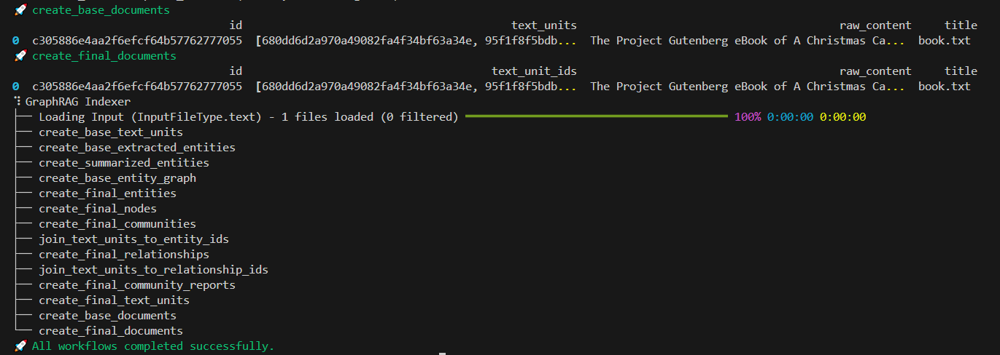

# Hacking GraphRAG 🌄

## Overview

Learn how to run [GraphRAG](https://www.microsoft.com/en-us/research/blog/graphrag-unlocking-llm-discovery-on-narrative-private-data/) pipelines backed by [Amazon Bedrock](https://aws.amazon.com/bedrock/) using [LiteLLM proxy](https://litellm.vercel.app/docs/simple_proxy).


## Steps

1. Create a new Conda environment

	```bash
	conda env create -f environment.yml
	conda activate graphrag
	```

2. Fire up the LiteLLM proxy

	```bash
	litellm -c config.yaml
	```

	

3. Run the GraphRAG pipeline

	```bash
	python -m graphrag.index --root ./ragtest
	```

	

4. Ask a question!

	```bash
	python -m graphrag.query \
       --root ./ragtest \
       --method global \
       "What are the top themes in this story?"
	```

**Output:**

```
SUCCESS: Global Search Response: "A Christmas Carol" by Charles Dickens explores several profound themes
through the transformative journey of Ebenezer Scrooge. Here are the key themes that emerge from the reports:

### Redemption and Transformation

The central theme revolves around Scrooge's transformation from a miserly, selfish individual to a kind and generous person, driven by his encounters with supernatural entities and reflections on his past [Data: Reports (47, 21, 15, 24)]. 

The story emphasizes the redemptive power of the Christmas spirit, as Scrooge undergoes a profound change, embracing generosity, kindness, and compassion towards others, particularly the less fortunate [Data: Reports (49, 48, 45)].

### The Role of Supernatural Guidance

The Ghost serves as a moral guide and catalyst for Scrooge's transformation, challenging his perspectives on wealth, poverty, and missed opportunities in life [Data: Reports (49, 48)].

The role of supernatural entities, such as ghosts and spirits, in guiding and influencing characters' transformations and self-discovery is a recurring theme [Data: Reports (47, 24, 15, 37)].

### The Importance of Family and Human Connections

The importance of family, human connections, and embracing the Christmas spirit is a recurring theme, contrasted with Scrooge's initial isolation and indifference [Data: Reports (47, 19, 30, 25)].

The Cratchit family, despite their poverty, is portrayed as a close-knit and loving unit, finding joy in their togetherness and the spirit of the Christmas season [Data: Reports (45)].

### The Contrast between Wealth and Poverty

The story explores the stark contrast between the wealthy, miserly Scrooge and the impoverished but joyful Cratchit family, highlighting the societal divide and the importance of empathy and compassion [Data: Reports (45, 49)].

The contrast between poverty and wealth, and the treatment of the less fortunate, is a prominent theme, with Scrooge initially displaying a lack of empathy towards the poor [Data: Reports (18, 12)].

### The Impact of Choices and Consequences

The impact of one's choices and actions on others, and the potential for redemption, is a significant theme explored through Scrooge's journey and the consequences faced by other characters [Data: Reports (47, 38, 24)].

### The Fleeting Nature of the Present

The Ghost of Christmas Present's life is limited, ending at midnight, symbolizing the fleeting nature of the present moment and the importance of cherishing and making the most of the present time [Data: Reports (48)].
```
